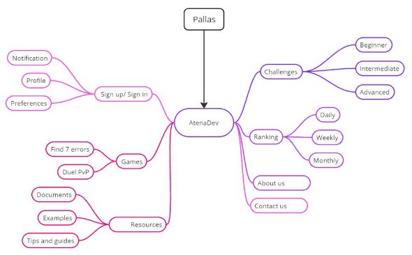
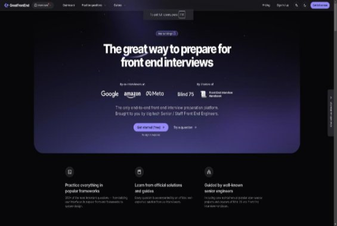
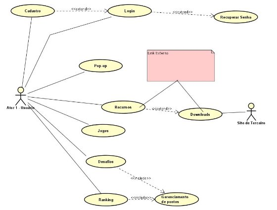
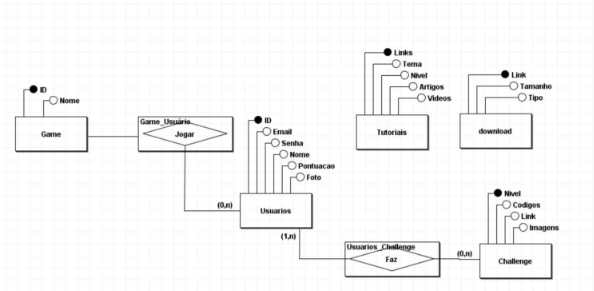
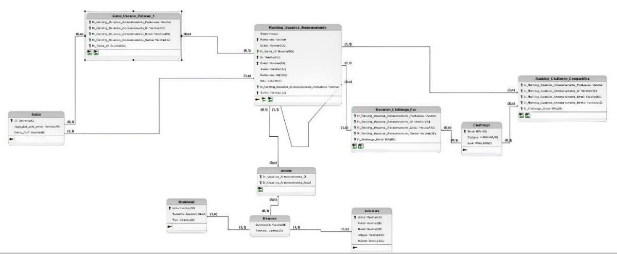

**Curso Superior de Desenvolvimento de Software Multiplataforma** 

Eduardo Kamo Iguei, 3011392413005 Iago Yuri Rossan, 3011392413038 

Lucas Vinicios Consani, 3011392413046 Matheus Nery de Camargo, 3011392413002 Nelson de Oliveira Junior, 3011392413014 

**Projeto Interdisciplinar Il Engenharia de Software Il Desenvolvimento Web Il Design Digital** 

**Athena.dev** 

**Orientadores:** 

` `**Profa Cristiane Palomar Mercado Profa Maria Janaína da Silva Ferreira Profo Jones Artur Gonçalves** 

**Votorantim 2024** 

0 

**Resumo** 

O avanço da tecnologia no cenário atual cresce de maneira exponencial, de forma que os profissionais da área aumentam constantemente e assim suas capacidades técnicas são cada vez mais exigidas, falando sobre programação front-end, saber construir  as estruturas das páginas já seria uma habilidade básica que um profissional deveria ter, porém, quando se está aprendendo programação, a dúvida que fica é como e onde treinar e aprender as habilidades necessárias. 

Este é o propósito do projeto *Athena.dev*, onde é proporcionado, de maneira divertida e descontraída, a aprendizagem de programação para que iniciantes, intermédios  ou  até  mesmo  profissionais  avançados  consigam  treinar  suas habilidades de programação em front-end para a criação de layouts populares de páginas. 

**SUMÁRIO** 

1. [DESCRIÇÃO DO PROJETO .......................................................... 1](#_page5_x82.00_y70.92)
1. [Proposta do Software ............................................................................ 1](#_page5_x82.00_y108.92)
2. [Justificativa ............................................................................................ 2](#_page6_x82.00_y609.92)
2. [Mapa do Site ......................................................................................... 3](#_page7_x82.00_y70.92)
2. [Logomarca ............................................................................................ 4](#_page8_x82.00_y70.92)
2. [REQUISITOS DO PROJETO ......................................................... 5](#_page9_x82.00_y70.92)
1. [Levantamento de Requisitos ................................................................. 5](#_page9_x82.00_y108.92)
2. [Requisitos Funcionais ........................................................................... 6](#_page10_x82.00_y70.92)
2. [Diagrama de Caso de Uso .................................................................... 7](#_page11_x82.00_y70.92)
2. [Descrição do Caso de Uso.................................................................... 8](#_page12_x82.00_y70.92)
2. [Requisitos Não Funcionais .................................................................. 13](#_page17_x82.00_y70.92)
3. [PROJETO DO SOFTWARE ......................................................... 13](#_page17_x82.00_y396.92)
1. [Tecnologias Utilizadas ........................................................................ 13](#_page17_x82.00_y434.92)
2. [Modelo de dados ................................................................................. 14](#_page18_x82.00_y70.92)
1. [Modelo Conceitual ............................................................................. 14](#_page18_x82.00_y109.92)
1. [Modelo Lógico .................................................................................... 15](#_page19_x82.00_y70.92)

   3. [Diagrama de Classe ............................................................................ 15](#_page19_x82.00_y345.92)
   3. [Diagrama de Atividades ...................................................................... 15](#_page19_x82.00_y453.92)
   3. [Diagrama de Sequência ...................................................................... 15](#_page19_x82.00_y565.92)
   3. [Interfaces com o usuário ..................................................................... 16](#_page20_x82.00_y70.92)
4. [ESTRATÉGIA DE TESTES .......................................................... 16](#_page20_x82.00_y249.92)
4. [IMPLANTAÇÃO ............................................................................ 16](#_page20_x82.00_y344.92)
4. [REFERÊNCIAS ............................................................................ 17](#_page21_x82.00_y70.92)

**LISTA DE FIGURAS** 

[Figura 1 - ODS 4 ........................................................................................... 1 ](file:///C:/Users/Alunos/Downloads/Pallas-%20Projeto%20Interdisciplinar%20II.docx%23_Toc176980431)[Figura 2 - ODS 8 ........................................................................................... 2 ](file:///C:/Users/Alunos/Downloads/Pallas-%20Projeto%20Interdisciplinar%20II.docx%23_Toc176980432)[Figura 3 - ODS 9 ........................................................................................... 2](file:///C:/Users/Alunos/Downloads/Pallas-%20Projeto%20Interdisciplinar%20II.docx%23_Toc176980433)

[Figura 4 - Mapa Mental ................................................................................. 3 ](#_page7_x82.00_y109.92)[Figura 5 - Logo Preto e Branco ..................................................................... 4 ](#_page8_x82.00_y135.92)[Figura 6 - Logo Normal ................................................................................. 4 ](#_page8_x82.00_y366.92)[Figura 7 - Página Inicial de GreatFrontEnd ................................................... 5 ](#_page9_x82.00_y231.92)[Figura 8 - Diagrama de Caso de Uso ........................................................... 7 ](#_page11_x82.00_y137.92)[Figura 9 - Modelo de Dados Conceitual ...................................................... 14](#_page18_x82.00_y172.92)

**LISTA DE QUADROS** 

[Quadro 1 - Requisitos Funcionais ................................................................. 6 ](#_page10_x82.00_y109.92)[Quadro 2 - Caso de Uso: Login .................................................................... 8 ](#_page12_x82.00_y109.92)[Quadro 3 - Caso de Uso: Sistema de Cadastro ............................................ 8 ](#_page12_x82.00_y401.92)[Quadro 4 - Caso de Uso: Notificações .......................................................... 9 ](#_page13_x82.00_y70.92)[Quadro 5 - Caso de Uso: Fórum ................................................................... 9 ](#_page13_x82.00_y355.92)[Quadro 6 - Caso de Uso: Ranking ................................................................ 9 ](#_page13_x82.00_y582.92)[Quadro 7 - Caso de Uso: Desafio ............................................................... 10 ](#_page14_x82.00_y70.92)[Quadro 8 - Caso de Uso: Gerenciamento de Perfil ..................................... 10 ](#_page14_x82.00_y425.92)[Quadro 9 - Caso de Uso: Gerenciamento de pop-ups ................................ 11 ](#_page15_x82.00_y70.92)[Quadro 10 - Caso de Uso: Acesso aos Jogos ............................................ 11 ](#_page15_x82.00_y333.92)[Quadro 11 - Caso de Uso: Acesso a informações sobre Equipe ................ 11 ](#_page15_x82.00_y568.92)[Quadro 12 - Caso de Uso: Download de Arquivo ....................................... 12 ](#_page16_x82.00_y70.92)[Quadro 13 - Caso de Uso: Acesso a Recursos .......................................... 12 ](#_page16_x82.00_y366.92)[Quadro 14 - Requisitos Não Funcionais ..................................................... 13](#_page17_x82.00_y109.92)

1. **DESCRIÇÃO DO PROJETO** 
1. **Proposta do Software** 

O  software  projetado  é  uma  ferramenta  web  que  disponibiliza  jogos  e desafios onde o programador poderá desenvolver a lógica e boas práticas de forma lúdica, através de atividades como: *Jogo dos sete erros* (encontrar erros no código) e *Duelo PVP* (onde o jogador tentará copiar a página o primeiro que seu adversário). Através de desafios, o usuário poderá ganhar pontos e desta forma acumular e subir sua posição em um ranking que pode, posteriormente, proporcionar de alguma forma uma recompensa. 

Sendo assim, o objetivo do projeto é treinar os interessados em melhorar suas habilidades de programação (Inicialmente apenas conceitos de frontend). 

O problema a ser enfrentado é a falta de profissionais capacitados, pois com o avanço constante da tecnologia, mais especificamente das IA’s, a necessidade de  conhecimento  “base”  aumentou  de  maneira  que  saber  o  básico  não  é suficiente. Portanto, serão aplicados desafios do básico até o avançado. 

O público-alvo que o site visa são aqueles que desejam ingressar no mercado de trabalho ou até mesmo quem deseja se divertir programando, pessoas que estão no nível mais básico, quem não sabe absolutamente nada e quem já vive de programação. 

Neste projeto serão abrangidas as seguintes ODS: 

*Figura 1 - ODS 4*

` `**(ODS-4)  Educação  de  qualidade**:  Serão proporcionados  recursos  (documentações  e posteriormente aulas e videoaulas) que serão guias para estudos. 

*Fonte:  1 - https://www.estrategiaods.org.br/os-ods/ods4/*

*Figura 2 - ODS 8*

**(ODS-8)  Trabalho  decente  e  crescimento econômico: **Ao proporcionar uma melhor educação e  o  acesso  a  ela,  o  projeto  visa  promover  as condições sociais econômicas dos usuários. 

*Fonte:  2 - https://www.estrategiaods.org.br/os-ods/ods8/ Figura 3 - ODS 9*

**(ODS-9) Indústria, inovação e infraestrutura:** O site  também  busca  agregar  no  conhecimento, criatividade e inovação, através de interações entre usuários e atualizações do mundo da tecnologia. 

*Fonte:  3 - https://www.estrategiaods.org.br/os-ods/ods9/*

**RESTRIÇÕES.:** Muitos dos recursos serão desenvolvidos no decorrer do curso, portanto  a  maioria  do  que  propusemos  não  estará  disponível  de  primeira instância.  

2. **Justificativa**  

`   `Foi analisado o ambiente de estudos na faculdade de tecnologia de Votorantim (FATEC), e identificou-se um problema para o estudo dos conteúdos propostos durante o percurso da graduação, destarte surgiu a ideia de criar este projeto para guiar e ensinar de maneira objetiva os que necessitam de tal recurso. 

3. **Mapa do Site** 

*Figura 4 - Mapa Mental* 

*Fonte:  4 - Autoria Própria* 

4. **Logomarca *Preto e branco***

   *Figura 5 - Logo Preto e Branco* 

   

   *Fonte:  5 - Autoria Própria* 

   ***Normal***

   *Figura 6 - Logo Normal* 

   

   *Fonte:  6 - Autoria Própria* 

2. **REQUISITOS DO PROJETO** 
1. **Levantamento de Requisitos** 

Foi realizada uma análise de mercado pesquisando outros sites que propõem 

- mesmo objetivo, e foram encontrados alguns exemplos como: 

[**GreatFrontEnd** ](https://www.greatfrontend.com/)

*Figura 7 - Página Inicial de GreatFrontEnd* 

*Fonte:  7 - https://www.greatfrontend.com/* 

GetFrontEnd  é  uma  plataforma  onde  se  obtém  meios  para  se  treinar entrevistas  de  Frontend,  tendo  sido  sendo  desenvolvida  por  engenheiros Frontend Sênior de grandes empresas de Tecnologia. Com o intuito de espalhar as informações e técnicas para o meio de Frontend. 

2. **Requisitos Funcionais** 

*Quadro 1 - Requisitos Funcionais* 

|**Nº Requisit o** |**Nome** |**Descrição** |
| :- | - | - |
|RF001 |Login |Fazer login no site com usuário e senha |
|RF002 |Sistema de Cadastro |Cadastro pessoal no site para utilização das funcionalidades |
|RF003 |Gerenciamento de Notificações |Notificações ao usuário sobre suas atividades e atualizações sobre seu perfil |
|RF004 |Ranking |Placar de liderança entre usuários que participam ativamente dos desafios |
|RF005 |Desafios |Atividades criadas para a prática de programação dos usuários |
|RF006 |Gerenciamento de Perfil |Controle do usuário sobre seu perfil, dados cadastrais e foto |
|RF007 |Jogos |Acesso do usuário aos jogos disponibilizados no site |
|RF008 |Acesso a informações sobre a equipe |Acesso a informações sobre a equipe desenvolvedora do site |
|RF009 |Downloads |Área de download de softwares para programação |
|RF010 |Acesso a Recursos |Área para que os usuários tenham acesso a recursos de programação (aulas, vídeo aulas, documentações, etc.) |

*Fonte:  8 - Autoria Própria* 

3. **Diagrama de Caso de Uso** 

*Figura 8 - Diagrama de Caso de Uso* 

*Fonte:  9 - Autoria Própria* 

4. **Descrição do Caso de Uso** 

*Quadro 2 - Caso de Uso: Login* 

|**Casos de Uso** |RF001 - Login |
| - | - |
|**Ator Principal** |Usuário |
|**Ator Secundário** |Sistema |
|**Pré-Condição** |Possuir conta cadastrada no banco de dados |
|**Pós-Condição** ||
|**Ações do Ator** |**Ações do Sistema** |
|1 - Fornecer usuário e senha ||
||2 - Consultar banco de dados |
||3 - Verificar os dados fornecidos pelo usuário |
|4 - Entrou no perfil ||
|**Restrições/Validações** |1\. Usuário e e-mail cadastrado no banco de dados |
|**Fluxo de Exceção - Usuário/senha errado** ||
|**Ações do Ator** |**Ações do Sistema** |
||1 - Comunicar que o usuário e/ou senha estão incorretos |
||2 - Não logar. |

*Fonte:  10 - Autoria Própria* 

*Quadro 3 - Caso de Uso: Sistema de Cadastro* 

<table><tr><th colspan="1" valign="top"><b>Casos de Uso</b> </th><th colspan="2">RF002 - Sistema de Cadastro </th></tr>
<tr><td colspan="1" valign="top"><b>Ator Principal</b> </td><td colspan="2">Usuário </td></tr>
<tr><td colspan="1" valign="top"><b>Ator Secundário</b> </td><td colspan="2">Sistema </td></tr>
<tr><td colspan="1" valign="top"><b>Pré-Condição</b> </td><td colspan="2"></td></tr>
<tr><td colspan="1" valign="top"><b>Pós-Condição</b> </td><td colspan="2"></td></tr>
<tr><td colspan="2"><b>Ações do Ator</b> </td><td colspan="1"><b>Ações do Sistema</b> </td></tr>
<tr><td colspan="2">1 - Fornecer os dados necessários </td><td colspan="1"></td></tr>
<tr><td colspan="2"></td><td colspan="1">2 - Verificar a veracidade do e-mail e validar senha e usuário e salvar no Banco de dados </td></tr>
<tr><td colspan="2">3 - Receber a mensagem que foi cadastrado com sucesso </td><td colspan="1"></td></tr>
<tr><td colspan="2"></td><td colspan="1">4 - Fornecer os recursos de um perfil logado </td></tr>
<tr><td colspan="2" rowspan="2"><b>Restrições/Validações</b> </td><td colspan="1">1\. Senha cumprindo os critérios </td></tr>
<tr><td colspan="1">2\. E-mail válido </td></tr>
<tr><td colspan="3"><b>Fluxo de Exceção - Senha não cumpre os critérios/ E-mail inválido</b> </td></tr>
<tr><td colspan="2"><b>Ações do Ator</b> </td><td colspan="1"><b>Ações do Sistema</b> </td></tr>
<tr><td colspan="2"></td><td colspan="1">1 - Comunicar que a invalidez em questão </td></tr>
<tr><td colspan="2"></td><td colspan="1">2 - Não cadastrar </td></tr>
</table>

*Fonte:  11 - Autoria Própria* 

*Quadro 4 - Caso de Uso: Notificações* 

|**Casos de Uso** |RF003 - Notificações |
| - | - |
|**Ator Principal** |Usuário |
|**Ator Secundário** |Sistema |
|**Pré-Condição** |Estar logado no site |
|**Pós-Condição** ||
|**Ações do Ator** |**Ações do Sistema** |
|1 - Clicar no ícone de notificação ||
||2 - Apresentar em formato de lista as "atualizações" que a conta recebeu |
|3 - Clicar na notificação ||
||4 - Redirecionar usuário para a página ou interface que descreva a "atualização" por completo e que ele consiga visualizar |

*Fonte:  12 - Autoria Própria Quadro 5 - Caso de Uso: Fórum* 

|**Casos de Uso** |RF004 – Fórum |
| - | - |
|**Ator Principal** |Usuário |
|**Ator Secundário** |Sistema |
|**Pré-Condição** ||
|**Pós-Condição** ||
|**Ações do Ator** |**Ações do Sistema** |
|1 - Acessar a página de Posts ||
||2 - Redirecionar o usuário para a página dinâmica que mostra os posts em tendências |

*Fonte:  13 - Autoria Própria 
Quadro 6 - Caso de Uso: Ranking* 

|**Casos de uso** |RF005 - Ranking |
| - | - |
|**Ator Principal** |Classificação dos usuários |
|**Ator Secundário** ||
|**Pré-Condição** |Usuário vai interagir com jogos e atividades dos sites |
|**Pós-Condição** |Após interação os pontos ganham iriam à classificação que seria atualizada |
|**Ações do Ator** |**Ações do Sistema** |
||1 - O sistema faz a avalição de pontos através da tarefa feita |
||2 - O sistema atualiza o ranking  |

*Fonte:  14 - Autoria Própria* 

*Quadro 7 - Caso de Uso: Desafio* 

|**Casos de uso** |RF006 - Desafio |
| - | - |
|**Ator Principal** |desafiar os usuários com códigos de básico a avançados |
|**Ator Secundário** |medir o conhecimento do usuário  |
|**Pré-Condição** |usuário vai interagir com desafios dos sites |
|**Pós-Condição** |ao desafio escolhido pelo usuário pontos serão distribuídos de acordo |
|**Ações do Ator** |**Ações do Sistema** |
|1- O usuário clica nos desafios ||
||2- O sistema volta com dificuldades dos desafios |
|3- O usuário escolhe a dificuldade ||
||4- O sistema retorna com os desafios da dificuldade escolhida |
|5-O usuário clica no desafio  ||
|6- O usuário faz o desafio ||
||7- Sistema analisa o desafio feito e dá a pontuação |
||8- O sistema manda a pontuação para o ranking |

*Fonte:  15 - Autoria Própria* 

*Quadro 8 - Caso de Uso: Gerenciamento de Perfil* 

|**Casos de uso** |RF007 - Gerenciamento de perfil |
| - | - |
|**Ator Principal** |Controle do usuário sobre seu perfil, postagens e foto |
|**Ator Secundário** ||
|**Pré-Condição** |usuário vai ir em gerenciamento  |
|**Pós-Condição** |
após receber a informação que o usuário quer postar ou mudar 

o sistema retorna  
|
|**Ações do Ator** |**Ações do Sistema** |
|1- O usuário vai clicar em gerenciamento ||
||2-- o sistema volta com o perfil do usuário |
|3-1- O usuário muda a foto de perfil ||
||3-2- o sistema atualiza a foto que o usuário colocou |
|4-1-O usuário clica em pôster ||
||4-2-o sistema volta pra ele escrever  |
|5-1- O usuário escreve e clicar em postar ||
||5-2- o sistema responde e posta na aba de pôster |
|6-1- O usuário muda o nome do perfil ||
||6-2 o sistema reponde atualizando o nome |

*Fonte:  16 - Autoria Própria* 

*Quadro 9 - Caso de Uso: Gerenciamento de pop-ups* 

|**Casos de uso** |RF008 - Gerenciamento de pop-ups |
| - | - |
|**Ator Principal** |Habilidade de fechar e interagir com pop-ups no site |
|**Ator Secundário** ||
|**Pré-Condição** |usuário vai interagir com o site em algo ex jogos |
|**Pós-Condição** |o sistema manda o pop-ups mandando sobre o assunto |
|**Ações do Ator** |**Ações do Sistema** |
|1 - O usuário faz a interação no site ||
||2 - O sistema volta como uma notificação |
||3 - O pop-ups notifica o usuário  |
||4 - Notificando se ele terminou um jogo ou desafio  |
||5 - Notificando quando ele edita o perfil |

*Fonte:  17 - Autoria Própria* 

*Quadro 10 - Caso de Uso: Acesso aos Jogos* 

|**Casos de uso** |RF009 - Acesso aos jogos |
| - | - |
|**Ator Principal** |Usuário |
|**Ator Secundário** |Sistema |
|**Pré-Condição** |O usuário deve estar cadastrado no sistema |
|**Pós-Condição** |Usuário acessa o jogo desejado |
|**Ações do Ator** |**Ações do Sistema** |
|1 - Login na plataforma ||
||2 - Sistema verifica cadastro do usuário |
|2 - Navegar até pagina de jogos ||
|3 - Selecionar jogo escolhido ||
||4 - Consulta banco de dados |
||5 - Permite acesso e inicia o jogo |

*Fonte:  18 - Autoria Própria* 

*Quadro 11 - Caso de Uso: Acesso a informações sobre Equipe* 

|**Casos de uso** |RF010 - Acesso a informações sobre equipe |
| - | - |
|**Ator Principal** |Usuário |
|**Ator Secundário** |Sistema |
|**Pré-Condição** |O usuário deve estar cadastrado no sistema |
|**Pós-Condição** |Usuário acessa página das informações |
|**Ações do Ator** |**Ações do Sistema** |
|1- Navega até área das informações ||
||2 - Mostra as informações desejadas |

*Fonte:  19 - Autoria Própria* 

*Quadro 12 - Caso de Uso: Download de Arquivo* 

|**Casos de uso** |RF011 - Download de Arquivo |
| - | - |
|**Ator Principal** |Usuário |
|**Ator Secundário** |Sistema de Download |
|**Pré-Condição** |O usuário deve estar cadastrado e o arquivo estar disponível |
|**Pós-Condição** |O arquivo é baixado e salvo no sistema do usuário |
|**Ações do Ator** |**Ações do Sistema** |
|1 - Navegar até página de downloads ||
|2- Usuário clica no botão de download ||
||3 - Sistema verifica disponibilidade do arquivo |
||4- Sistema prepara arquivo pra download |
|5- Escolhe local pra salvar arquivo ||
||6 - Sistema envia arquivo pra dispositivo do usuário |

*Fonte:  20 - Autoria Própria* 

*Quadro 13 - Caso de Uso: Acesso a Recursos* 

|**Casos de uso** |RF012 - Acesso a recursos |
| - | - |
|**Ator Principal** |Usuário |
|**Ator Secundário** |Sistema |
|**Pré-Condição** |O usuário deve estar autenticado e o recurso desejado disponível |
|**Pós-Condição** |Usuário acessa recurso solicitado |
|**Ações do Ator** |**Ações do Sistema** |
|1 -Login no sistema ||
||2 - Verifica autenticação do usuário |
|3- Solicita acesso ao recurso ||
||4 - Permite o acesso do usuário ao recurso |
||5 - Registra o acesso do usuário ao recurso |

*Fonte:  21 - Autoria Própria* 

5. **Requisitos Não Funcionais** 

*Quadro 14 - Requisitos Não Funcionais* 

|**Nº Requisito** |**Nome** |**Descrição** |
| :- | - | - |
|RNF001 |Acessibilidade |Acessibilidade para pessoas com dificuldade e/ou deficiência de visualização |
|RNF002 |Portabilidade |Capacidade do site de ser visto de forma diferente dependendo no dispositivo que é acessado |
|RNF003 |Tempo de resposta/vel. De execução |Velocidade em que o site responde a comandos do usuário |
|RNF004 |Segurança |Criptografia de senhas e usuários/Autenticação |
|RNF005 |Desempenho |Exigências para execução |

*Fonte:  22 - Autoria Própria* 

3. **PROJETO DO SOFTWARE** 
1. **Tecnologias Utilizadas** 

Até o momento (18/08/2024) foi utilizado apenas linguagens de marcação (HTML), de estilização (CSS) e de programação (Javascript). 

2. **Modelo de dados** 
1. **Modelo Conceitual**

*Figura 9 - Modelo de Dados Conceitual* 

*Fonte:  23 - Autoria Própria* 

2. **Modelo Lógico**

3. **Diagrama de Classe** 

Inserir aqui o diagrama de classes conceitual do sistema 

4. **Diagrama de Atividades** 

As atividades foram distribuídas em formas de páginas para cada um dos membros  do  projeto  teria  como  responsável  por  programar  e  testar  suas funcionalidades. 

5. **Diagrama de Sequência** 

Inserir  aqui  o  diagrama  de  sequência  (a  quantidade  de  diagramas  será definida pelo professor).  

6. **Interfaces com o usuário** 

`   `Nesta página inicial do site foi-se pensado em deixar os conteúdos destaques a mostra para chamar a atenção, caso a pessoa tenha interesse ela pode navegar clicando nos conteúdos e ser direcionada para as páginas descrevendo 

- conteúdo proposto e apresentando as interações possíveis para o usuário desfrutar. 
4. **ESTRATÉGIA DE TESTES** 

   Explicar o plano e se foi utilizada alguma ferramenta de testes. 

5. **IMPLANTAÇÃO** 

   [**GITHUB** ](https://github.com/edukamoz/Pallas)

6. **REFERÊNCIAS** 

BRASIL. **Brasil terá déficit de 530 mil profissionais de tecnologia até 2025, mostra estudo do Google**. Disponível em: <https://g1.globo.com/trabalho-e- carreira/noticia/2023/05/31/brasil-tera-deficit-de-530-mil-profissionais-de-tecnologia- ate-2025-mostra-estudo-do-google.ghtml>. Acesso em: 18 jun. 2024. 

` `CAUTI, C. **5 razões porque faltam desenvolvedores de softwares no Brasil**. Disponível em: <https://exame.com/carreira/razoes-faltam-desenvolvedores-softwares- brasil/>. Acesso em: 18 jun. 2024. 
17 
